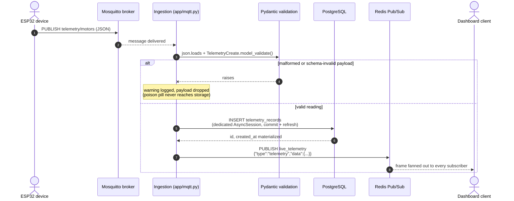
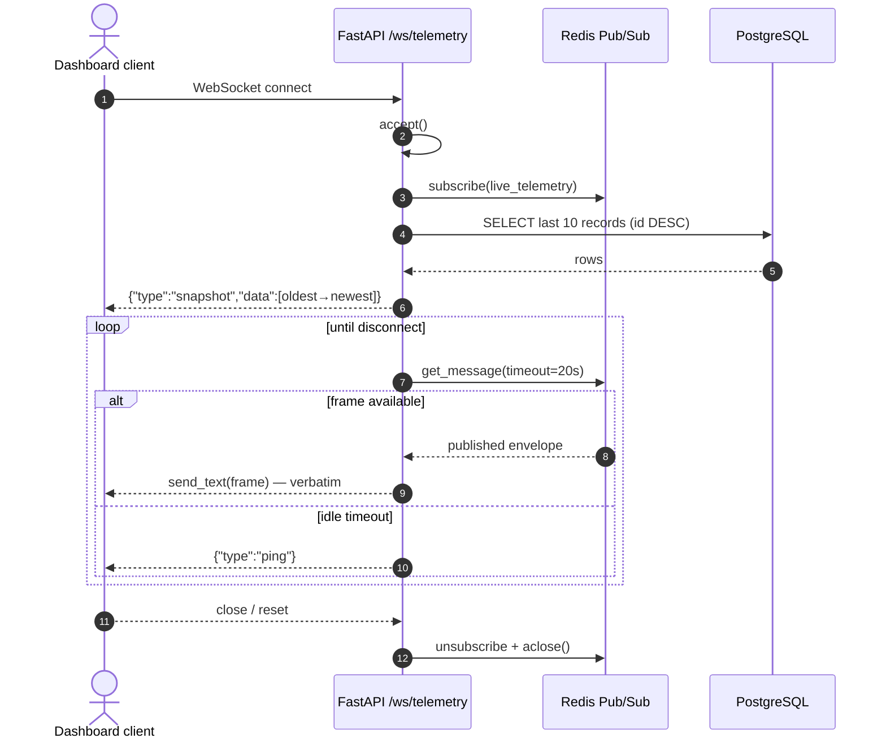

# Architecture: In-Depth Technical Analysis

Technical reference for the telemetry backend. For project scope and data contracts, see [`context.md`](context.md).

## System Sequence Diagram



## 1. Ingestion Pipeline (`app/mqtt.py`)

### Connection handling
The consumer is a single `asyncio` task created in FastAPI's `lifespan`, so its lifetime exactly matches the application's. It runs an outer `while True` loop that constructs a fresh `aiomqtt.Client` per connection attempt and iterates `client.messages` — aiomqtt converts the paho-mqtt callback API into a native async iterator. Inside a healthy connection there are no reconnects and no polling; messages arrive as they are brokered.

### Reconnect with capped exponential backoff
Any `aiomqtt.MqttError` (broker restart, network blip) bubbles out of the iterator and is caught by the outer loop:

```python
delay = min(delay * 2, MAX_RECONNECT_DELAY_S)   # 1s → 2 → 4 → ... → 30s cap
logger.warning("MQTT connection lost (%s); retrying in %ss", error, delay)
await asyncio.sleep(delay)
```

- Backoff starts at **1 s** and doubles to a **30 s ceiling**, preventing hammering a downed broker.
- On a successful connect the delay **resets** to 1 s, so recovery after brief restarts stays snappy.
- The task is cancelled during shutdown; `asyncio.CancelledError` propagates through the sleep/iterator and is suppressed by the lifespan, guaranteeing clean teardown.

### Per-message processing and validation
Each incoming MQTT payload passes two independent gates:

1. **JSON parse** — `json.loads(payload)` failure logs `Dropping malformed JSON payload` and returns.
2. **Schema validation** — `TelemetryCreate.model_validate(...)` enforces the contract: `device_id` required string of 1–64 chars, numeric accel axes, optional integer `ts`. Failures log `Dropping payload failing schema validation`.

Both gates *return early* rather than raise past the loop — a poison pill costs one warning line and nothing else. Ordering is preserved because messages are processed serially in arrival order on the single consumer task; combined with the auto-increment primary key this yields a server-authoritative ingestion sequence.

Delivery semantics are QoS 0 (fire-and-forget): for high-frequency vibration monitoring an occasional dropped reading is preferable to broker-side queuing lag. The pipeline is therefore at-most-once per attempt, with no duplicate-suppression complexity.

## 2. Database Design (`app/database.py`, `app/models.py`)

### SQLAlchemy 2.0 async patterns
- `DeclarativeBase` with `Mapped[...]` / `mapped_column` typed declarations — full IDE/type-checker support.
- Engine created once with `pool_pre_ping=True`: stale connections killed by Postgres restarts are detected and replaced transparently instead of surfacing as errors mid-request.
- Sessions come from `async_sessionmaker(engine, expire_on_commit=False)`: committed objects stay usable without implicit lazy-load round trips.

### Table `telemetry_records`

| Column | Type | Notes |
| --- | --- | --- |
| `id` | `BigInteger` PK | Auto-increment; authoritative ordering key |
| `device_id` | `String(64)` | Indexed — dashboard per-device filtering |
| `ts` | `BigInteger`, nullable | Client-side Unix epoch seconds |
| `accel_x/y/z` | `Float` | Vibration axes |
| `temp_c` | `Float` | Temperature |
| `created_at` | `DateTime(timezone=True)` | `server_default=func.now()` |

### Why auto-increment `id` orders records (not `ts`)
`ts` is client-supplied and optional: ESP32 clocks drift, and nodes that omit it get a server fallback at insert time. Using it as a global sort key would interleave records incorrectly across devices. Instead:

- **Ingestion order == commit order == `id` order**, because the single consumer task commits serially.
- `/telemetry/latest` and the WebSocket snapshot both use `ORDER BY id DESC LIMIT n`; the snapshot reverses the result set to present chronological (oldest→newest) frames.
- `id` also serves as a natural cursor for future pagination.

### Time-series field handling
- `ts` is stored as raw epoch seconds (`BigInteger`) — compact, timezone-free, and directly comparable if the sensor provides it; `NULL` means "device had no clock".
- `created_at` is assigned by Postgres (`now()`), making ingest time trustworthy regardless of device state. Because it is server-generated, the consumer calls `await session.refresh(record)` immediately after commit — with `expire_on_commit=False` the object would otherwise carry `created_at=None` and fail response serialization.
- `Float` precision is sufficient for analytics-range accelerometer and temperature values and keeps rows narrow for high write volume.

## 3. Real-Time Broadcast (`app/redis.py`, `app/main.py`)

### Channel architecture
One channel, `live_telemetry`, carries one message per persisted record — published exactly once, only after the database commit succeeds (a failed write returns before any publish). Serialization uses `model_dump(mode="json")` so datetimes become ISO strings up front, and the Redis client runs with `decode_responses=True` so frames are plain `str` ready for `send_text` with zero re-encoding.

Publishing is wrapped defensively: a Redis outage logs an exception but cannot abort ingestion — persistence remains the source of truth, streaming degrades gracefully.

### WebSocket lifecycle (`/ws/telemetry`)
Per connected dashboard client:



Key design points:

- **One `pubsub()` per client, never shared.** In redis-py each Pub/Sub object owns a dedicated pooled connection; sharing one across sockets would interleave frames randomly between clients.
- **Snapshot + live contract.** The snapshot (`last 10`, reversed to oldest→newest) closes the gap between "connect" and "first publish" — no record can slip through unobserved, and the UI can paint history instantly. Live frames are forwarded byte-for-byte from the channel, so every client sees identical payloads.
- **Keepalive doubles as a liveness probe.** `get_message(timeout=20 s)` returning `None` triggers a `ping` frame; writing to a dead socket raises there, converting silent disconnects into handled exceptions promptly.
- **Guaranteed cleanup.** A `finally` block unsubscribes and calls `pubsub.aclose()` on every exit path — clean `WebSocketDisconnect`, abrupt TCP reset, or relay exception — so Pub/Sub connections cannot leak under churn.

| Frame | Shape | Timing |
| --- | --- | --- |
| `snapshot` | `{"type":"snapshot","data":[≤10 records]}` | Once, immediately after accept |
| `telemetry` | `{"type":"telemetry","data":{record}}` | Per ingested reading |
| `ping` | `{"type":"ping"}` | Every ~20 s of silence |

## 4. Fault Tolerance

### Session isolation per message
Every message opens its own `AsyncSession` inside an `async with` block. Commit failures roll back and release that session alone; the next message starts from a clean session rather than inheriting broken transaction state. This is what makes poison pills structurally impossible to escalate.

### Poison-pill containment
Invalid input is neutralized at the cheapest possible layer and never reaches storage or the broadcast path:

| Payload | Gate | Outcome |
| --- | --- | --- |
| Non-JSON bytes | `json.loads` | Logged, dropped |
| Valid JSON, wrong shape | Pydantic schema | Logged, dropped |
| DB write failure | Session rollback | Logged, dropped (at-most-once semantics) |
| Redis unavailable | Publish guard | Logged; record still persisted |

Verified behavior: interleaving garbage and schema-violating frames between valid readings leaves the loop fully operational — subsequent valid readings persist and stream normally.

### Dependency restarts
- **Mosquitto restart:** consumer hits `MqttError`, backs off (1→30 s), resubscribes on recovery. Messages published during the gap are lost (QoS 0), never duplicated.
- **PostgreSQL restart:** `pool_pre_ping` evicts dead connections on first touch; writes during the outage are logged and dropped, then resume automatically.
- **Redis restart:** broadcast frames are lost for the outage window; snapshots on new connects self-heal any missed history.

### Graceful shutdown sequencing
Lifespan teardown is ordered to prevent work against closed resources:

```python
mqtt_task.cancel()                     # 1. stop ingress at the source
with suppress(asyncio.CancelledError):
    await mqtt_task                    # 2. wait for the consumer to exit cleanly
await redis_client.aclose()            # 3. close broadcast transport
await engine.dispose()                 # 4. retire DB connections last
```

Cancelling before closing pools guarantees no in-flight handler can grab a connection that is already gone.
