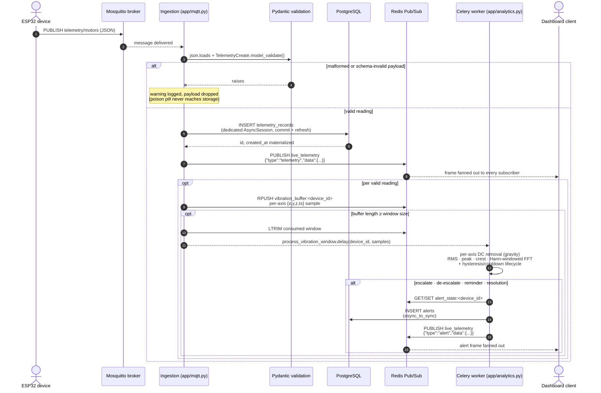
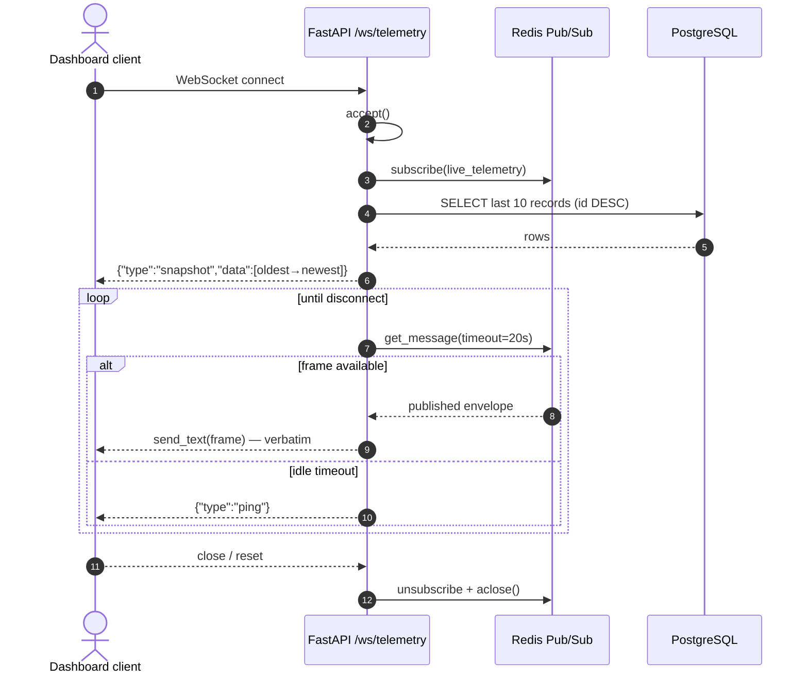

# Architecture: In-Depth Technical Analysis

Technical reference for the telemetry backend. For project scope and data contracts, see [`context.md`](context.md).

## System Sequence Diagram


```mermaid
sequenceDiagram
    autonumber
    actor ESP as ESP32 device
    participant MQ as Mosquitto broker
    participant ING as Ingestion (app/mqtt.py)
    participant VAL as Pydantic validation
    participant PG as PostgreSQL
    participant RD as Redis Pub/Sub
    participant CEL as Celery worker (app/analytics.py)
    actor DASH as Dashboard client

    ESP->>MQ: PUBLISH telemetry/motors (JSON)
    MQ-->>ING: message delivered
    ING->>VAL: json.loads + TelemetryCreate.model_validate()

    alt malformed or schema-invalid payload
        VAL--xING: raises
        Note over ING: warning logged, payload dropped<br/>(poison pill never reaches storage)
    else valid reading
        ING->>PG: INSERT telemetry_records<br/>(dedicated AsyncSession, commit + refresh)
        PG-->>ING: id, created_at materialized
        ING->>RD: PUBLISH live_telemetry<br/>{"type":"telemetry","data":{...}}
        RD-->>DASH: frame fanned out to every subscriber

        opt per valid reading
            ING->>RD: RPUSH vibration_buffer:<device_id><br/>per-axis {x,y,z,ts} sample
            opt buffer length ≥ window size
                ING->>RD: LTRIM consumed window
                ING-->>CEL: process_vibration_window.delay(device_id, samples)
                CEL->>CEL: per-axis DC removal (gravity)<br/>RMS · peak · crest · Hann-windowed FFT<br/>+ hysteresis/cooldown lifecycle
                alt escalate · de-escalate · reminder · resolution
                    CEL->>RD: GET/SET alert_state:<device_id>
                    CEL->>PG: INSERT alerts<br/>(async_to_sync)
                    CEL->>RD: PUBLISH live_telemetry<br/>{"type":"alert","data":{...}}
                    RD-->>DASH: alert frame fanned out
                end
            end
        end
    end
```

## 1. Ingestion Pipeline (`app/mqtt.py`)

### Connection handling
The consumer is a single `asyncio` task created in FastAPI's `lifespan`, so its lifetime exactly matches the application's. It runs an outer `while True` loop that constructs a fresh `aiomqtt.Client` per connection attempt and iterates `client.messages` — aiomqtt converts the paho-mqtt callback API into a native async iterator. Inside a healthy connection there are no reconnects and no polling; messages arrive as they are brokered.

### Reconnect with capped exponential backoff
Any `aiomqtt.MqttError` (broker restart, network blip) bubbles out of the iterator and is caught by the outer loop:

```python
delay = min(delay * 2, MAX_RECONNECT_DELAY_S)   # 1s → 2 → 4 → ... → 30s cap
logger.warning("MQTT connection lost (%s); retrying in %ss", error, delay)
await asyncio.sleep(delay)
```

- Backoff starts at **1 s** and doubles to a **30 s ceiling**, preventing hammering a downed broker.
- On a successful connect the delay **resets** to 1 s, so recovery after brief restarts stays snappy.
- The task is cancelled during shutdown; `asyncio.CancelledError` propagates through the sleep/iterator and is suppressed by the lifespan, guaranteeing clean teardown.

### Per-message processing and validation
Each incoming MQTT payload passes two independent gates:

1. **JSON parse** — `json.loads(payload)` failure logs `Dropping malformed JSON payload` and returns.
2. **Schema validation** — `TelemetryCreate.model_validate(...)` enforces the contract: `device_id` required string of 1–64 chars, numeric accel axes, optional integer `ts`. Failures log `Dropping payload failing schema validation`.

Both gates *return early* rather than raise past the loop — a poison pill costs one warning line and nothing else. Ordering is preserved because messages are processed serially in arrival order on the single consumer task; combined with the auto-increment primary key this yields a server-authoritative ingestion sequence.

Delivery semantics are QoS 0 (fire-and-forget): for high-frequency vibration monitoring an occasional dropped reading is preferable to broker-side queuing lag. The pipeline is therefore at-most-once per attempt, with no duplicate-suppression complexity.

### Fixed-window vibration buffering
After a record is persisted and broadcast, the consumer feeds the analytics engine through a Redis-backed window per device (see `_buffer_vibration_window` in `app/mqtt.py`):

```python
sample = {"x": accel_x, "y": accel_y, "z": accel_z, "ts": ts}
await redis_client.rpush(key, json.dumps(sample))   # key: vibration_buffer:<device_id>
```

- Each valid reading **RPUSH**es a **per-axis** sample, not a pre-reduced magnitude. Keeping the axes intact is what lets the analyser remove gravity per axis and resolve a per-axis frequency; collapsing to `√(x²+y²+z²)` at ingest throws that information away permanently.
- The window is **fixed-size and non-overlapping**: once `LLEN >= VIBRATION_WINDOW_SAMPLES` (default 512) the consumer reads exactly that many samples, **LTRIM**s them off the front, then dispatches. Consuming *before* dispatching means a broker failure loses one window instead of re-analysing the same window forever. Overflow samples are retained and seed the next window.
- Backlog is bounded by `BUFFER_MAX_LENGTH` (3 × window). Anything beyond that is stale — a reconnecting device replaying, or a stalled worker — and is trimmed from the front with a warning.
- Entries that fail to parse are logged and skipped; a short window is never dispatched.
- A buffer update failure is caught and logged (`Vibration buffer update failed for device ...`) — it never aborts ingestion or affects the already-committed telemetry record/broadcast.

## 2. Database Design (`app/database.py`, `app/models.py`)

### SQLAlchemy 2.0 async patterns
- `DeclarativeBase` with `Mapped[...]` / `mapped_column` typed declarations — full IDE/type-checker support.
- Engine created once with `pool_pre_ping=True` **and** `poolclass=NullPool`: stale connections killed by Postgres restarts are detected and replaced transparently, and no connection is cached across event loops. `NullPool` (one connection per checkout, closed on return) is the key to keeping the shared async engine safe when async I/O runs inside Celery workers — pooled connections bound to a closed event loop are never handed back out.
- Sessions come from `async_sessionmaker(engine, expire_on_commit=False)`: committed objects stay usable without implicit lazy-load round trips.

### Table `telemetry_records`

| Column | Type | Notes |
| --- | --- | --- |
| `id` | `BigInteger` PK | Auto-increment; authoritative ordering key |
| `device_id` | `String(64)` | Indexed — dashboard per-device filtering |
| `ts` | `BigInteger`, nullable | Client-side Unix epoch seconds |
| `accel_x/y/z` | `Float` | Vibration axes |
| `temp_c` | `Float` | Temperature |
| `created_at` | `DateTime(timezone=True)` | `server_default=func.now()` |

### Table `alerts`

Produced by the Celery analytics engine (and writable via `POST /api/v1/alerts`); consumed by the history/alert REST endpoints.

| Column | Type | Notes |
| --- | --- | --- |
| `id` | `BigInteger` PK | Auto-increment |
| `device_id` | `String(64)` | Indexed — per-device alert filtering |
| `severity` | `String(32)` | `WARNING`, `CRITICAL`, or `RESOLVED` |
| `metric` | `String(32)` | `vibration` (currently the only metric) |
| `value` | `Float` | Observed resultant acceleration RMS (m/s²) at alert time |
| `threshold` | `Float` | Severity entry level that was breached |
| `message` | `String(255)` | Human-readable alert text |
| `created_at` | `DateTime(timezone=True)` | `server_default=func.now()` |

### Why auto-increment `id` orders records (not `ts`)
`ts` is client-supplied and optional: ESP32 clocks drift, and nodes that omit it get a server fallback at insert time. Using it as a global sort key would interleave records incorrectly across devices. Instead:

- **Ingestion order == commit order == `id` order**, because the single consumer task commits serially.
- `/telemetry/latest` and the WebSocket snapshot both use `ORDER BY id DESC LIMIT n`; the snapshot reverses the result set to present chronological (oldest→newest) frames.
- `id` also serves as a natural cursor for future pagination.

### Time-series field handling
- `ts` is stored as raw epoch seconds (`BigInteger`) — compact, timezone-free, and directly comparable if the sensor provides it; `NULL` means "device had no clock".
- `created_at` is assigned by Postgres (`now()`), making ingest time trustworthy regardless of device state. Because it is server-generated, the consumer calls `await session.refresh(record)` immediately after commit — with `expire_on_commit=False` the object would otherwise carry `created_at=None` and fail response serialization.
- `Float` precision is sufficient for analytics-range accelerometer and temperature values and keeps rows narrow for high write volume.

## 3. Real-Time Broadcast (`app/redis.py`, `app/main.py`)

### Channel architecture
One channel, `live_telemetry`, carries one message per persisted record — published exactly once, only after the database commit succeeds (a failed write returns before any publish). Serialization uses `model_dump(mode="json")` so datetimes become ISO strings up front, and the Redis client runs with `decode_responses=True` so frames are plain `str` ready for `send_text` with zero re-encoding.

Publishing is wrapped defensively: a Redis outage logs an exception but cannot abort ingestion — persistence remains the source of truth, streaming degrades gracefully.

### WebSocket lifecycle (`/ws/telemetry`)
Per connected dashboard client:


```mermaid
sequenceDiagram
    autonumber
    actor DASH as Dashboard client
    participant API as FastAPI /ws/telemetry
    participant PS as Redis Pub/Sub
    participant PG as PostgreSQL

    DASH->>API: WebSocket connect
    API->>API: accept()
    API->>PS: subscribe(live_telemetry)
    API->>PG: SELECT last 10 records (id DESC)
    PG-->>API: rows
    API-->>DASH: {"type":"snapshot","data":[oldest→newest]}
    loop until disconnect
        API->>PS: get_message(timeout=20s)
        alt frame available
            PS-->>API: published envelope
            API-->>DASH: send_text(frame) — verbatim
        else idle timeout
            API-->>DASH: {"type":"ping"}
        end
    end
    DASH-->>API: close / reset
    API->>PS: unsubscribe + aclose()
```

Key design points:

- **One `pubsub()` per client, never shared.** In redis-py each Pub/Sub object owns a dedicated pooled connection; sharing one across sockets would interleave frames randomly between clients.
- **Snapshot + live contract.** The snapshot (`last 10`, reversed to oldest→newest) closes the gap between "connect" and "first publish" — no record can slip through unobserved, and the UI can paint history instantly. Live frames are forwarded byte-for-byte from the channel, so every client sees identical payloads.
- **Keepalive doubles as a liveness probe.** `get_message(timeout=20 s)` returning `None` triggers a `ping` frame; writing to a dead socket raises there, converting silent disconnects into handled exceptions promptly.
- **Guaranteed cleanup.** A `finally` block unsubscribes and calls `pubsub.aclose()` on every exit path — clean `WebSocketDisconnect`, abrupt TCP reset, or relay exception — so Pub/Sub connections cannot leak under churn.

| Frame | Shape | Timing |
| --- | --- | --- |
| `snapshot` | `{"type":"snapshot","data":[≤10 records]}` | Once, immediately after accept |
| `telemetry` | `{"type":"telemetry","data":{record}}` | Per ingested reading |
| `alert` | `{"type":"alert","data":{alert record}}` | When the Celery engine raises WARNING/CRITICAL |
| `ping` | `{"type":"ping"}` | Every ~20 s of silence |

## 4. Analytics Engine (`app/celery_app.py`, `app/analytics.py`)

### Celery instance
`celery_app = Celery("iot_analytics", broker=settings.redis_url, backend=settings.redis_url)` — Redis doubles as both the task queue and the result backend. The worker runs in a separate container (`iot-celery-worker`) that shares the project image, so the analytics code and everything it imports (`crud`, models, schemas, Redis) are always in sync with the API.

### Signal analysis: `analyze_window`
All signal math lives in the pure function `app.analytics.analyze_window(samples) -> dict`. It takes a list of per-axis samples and returns metrics, with no Redis, Celery, or database involved, which is what makes `scripts/check_analytics.py` able to verify it against synthetic signals with known answers.

The stages, and why each one is there:

1. **Gravity and bias removal.** Each axis has its own DC component removed (`values - values.mean()`). Gravity is a constant offset on whichever axis the board happens to be mounted on, so removing it per axis removes it *regardless of orientation* — no assumption about which axis is vertical, and slow bias goes with it. Every metric below is computed from this AC signal.

   This is why the buffer keeps all three axes. Taking `√(x²+y²+z²)` at ingest would bake gravity into a ~9.81 m/s² offset and fold genuine 1× running-speed vibration into it non-linearly.

2. **Sample rate from timestamps.** The rate is derived from the device's own `ts` values (`(n-1) / (t_last - t_first)`) rather than assumed. A wrong assumption scales the *entire* frequency axis by a constant factor and produces confident, plausible, wrong numbers. When timestamps are missing, non-increasing, or imply an implausible rate, the analyser falls back to `VIBRATION_FALLBACK_SAMPLE_RATE_HZ` and reports `sample_rate_source: "fallback"` so the caveat travels with the data instead of being hidden.

3. **Time-domain metrics.** Per-axis and resultant acceleration RMS, per-axis and resultant peak, peak-to-peak, and crest factor (peak / RMS). The resultant is `√(x²+y²+z²)` of the *AC* components.

4. **FFT.** A **Hann taper** is applied before `scipy.fft.rfft`, with `rfftfreq(n, d=dt)` giving the bin axis. The taper is not cosmetic: without it, spectral leakage smears energy across neighbouring bins and `argmax` can report a frequency that is not in the signal at all. `hf_energy_ratio` is the fraction of total spectral energy above `hf_band_start_fraction` × Nyquist.

5. **Dominant frequency.** The peak of the total energy spectrum across all three axes, with `dominant_axis` naming the axis contributing most amplitude at that bin.

### Severity classification
Two-step, and the two steps are deliberately separate:

**RMS thresholds** classify on resultant acceleration RMS (m/s²):

| Level | Entry | Release |
| --- | --- | --- |
| `WARNING` | ≥ 2.0 | < 1.6 |
| `CRITICAL` | ≥ 5.0 | < 4.0 |

**Spectral escalation** promotes one step when the signal is impulsive and HF-dominated: `hf_energy_ratio >= 0.30` **and** `crest_factor >= 3.5`. Impulsive broadband energy with a low overall RMS is the classic early-bearing-fault signature, and it is the case a pure RMS method is blind to. Both conditions are required — smooth broadband noise satisfies neither, so ordinary noise cannot trigger it.

`VIBRATION_SPECTRAL_ESCALATION_FROM_NORMAL` (default on) controls whether the spectrum may raise a `WARNING` when RMS is still nominal. That is the valuable behaviour for early detection and also the easiest way to manufacture false positives, so it is a switch rather than a fixed rule.

> **On ISO 10816.** The system deliberately does **not** claim ISO 10816/20816 conformance. Those zones are defined on RMS *velocity* in mm/s, measured at a specified point on a machine of a specified class over a specified frequency range. This project measures *acceleration* from a single MPU6050 on a small motor, with no anti-alias filtering and no velocity integration, so applying those limits to these numbers would be unfounded. The thresholds here are project-defined and documented as such.

### Alert lifecycle (`app/alert_state.py`)
The decision logic is pure and synchronous — no I/O — so it is unit-testable and independent of Redis. `decide(previous_state, rms, spectral_escalation, now)` returns a severity, an `emit` flag, a `kind`, and a human-readable reason.

**Hysteresis.** Severity is only released once the metric falls below the *clear* level for that severity. Without this, a motor sitting at 1.8 m/s² flaps between `NORMAL` and `WARNING` on every window, and a new alert row is written on each flap.

**Cooldown.** While a severity stays active it is re-emitted only after `VIBRATION_ALERT_COOLDOWN_S` (default 300 s). Without this, an unhealthy motor produces one alert row per window, forever.

**Kinds.**

| Kind | When | Alert row severity |
| --- | --- | --- |
| `escalation` | Severity rose | the new severity |
| `deescalation` | Severity dropped but stayed above `NORMAL` | the new severity |
| `reminder` | Still breaching after the cooldown | unchanged severity |
| `resolution` | Returned to `NORMAL` from an active state | `RESOLVED` |
| `none` | Suppressed or steady | no row written |

**State** is one JSON blob per device at `alert_state:{device_id}` (severity, `last_alert_at`, `updated_at`) with a TTL. Reads and writes never raise: a Redis outage costs hysteresis history, not vibration analysis. The worker uses a **blocking** Redis client (`sync_redis_client`) rather than bridging into asyncio to read one key.

### Alert persistence & broadcast
When `decide` returns `emit=True`, the task builds an `alert_data` dict (device_id, severity, metric, value, threshold, message) and bridges into the async world with `async_to_sync(_persist_and_broadcast(alert_data))`:

- **Persist:** a dedicated `AsyncSessionLocal` inserts an `Alert` row, then `refresh` materializes `id`/`created_at` — the same session-isolation pattern ingestion uses.
- **Broadcast:** the committed alert is serialized with `AlertResponse.model_dump(mode="json")` and published to the shared `live_telemetry` channel as `{"type":"alert","data":{...}}`, so it arrives on every subscribed dashboard. Publish failures are logged but never abort the worker (persistence is the source of truth).

### Async bridge
The worker is synchronous but persistence and broadcast need async I/O. The bridge is `asgiref.sync.async_to_sync`, which runs the coroutine on a fresh loop per call. That is safe here because the engine uses `NullPool` (`app/database.py`) — no connection is cached across loops — and `redis_client` is only used for a single publish inside the same coroutine. If connection pooling is ever enabled on the engine, this needs revisiting: a persistent per-process loop would be required.

The task returns a JSON-serializable dict containing the full metric set — `rms_accel_m_s2`, per-axis RMS and peak, `peak_accel_m_s2`, `crest_factor`, `dominant_frequency_hz` (plus per-axis variants), `dominant_axis`, `hf_energy_ratio`, `spectral_escalation`, `window_samples`, `window_duration_s`, `sample_rate_hz`, `sample_rate_source`, `rms_severity` — alongside `previous_severity`, `severity`, `alert_kind`, `decision_reason`, and `alert_raised`.

## 5. Fault Tolerance

### Session isolation per message
Every message opens its own `AsyncSession` inside an `async with` block. Commit failures roll back and release that session alone; the next message starts from a clean session rather than inheriting broken transaction state. This is what makes poison pills structurally impossible to escalate.

### Poison-pill containment
Invalid input is neutralized at the cheapest possible layer and never reaches storage or the broadcast path:

| Payload | Gate | Outcome |
| --- | --- | --- |
| Non-JSON bytes | `json.loads` | Logged, dropped |
| Valid JSON, wrong shape | Pydantic schema | Logged, dropped |
| DB write failure | Session rollback | Logged, dropped (at-most-once semantics) |
| Redis unavailable | Publish guard | Logged; record still persisted |

Verified behavior: interleaving garbage and schema-violating frames between valid readings leaves the loop fully operational — subsequent valid readings persist and stream normally.

### Dependency restarts
- **Mosquitto restart:** consumer hits `MqttError`, backs off (1→30 s), resubscribes on recovery. Messages published during the gap are lost (QoS 0), never duplicated.
- **PostgreSQL restart:** `pool_pre_ping` evicts dead connections on first touch; writes during the outage are logged and dropped, then resume automatically.
- **Redis restart:** broadcast frames are lost for the outage window; snapshots on new connects self-heal any missed history. Celery tasks queued during the outage are redelivered once Redis recovers (Redis is also the Celery broker); in-flight alert persistence/broadcast retry on restart.
- **Celery worker restart / Redis broker outage:** pending vibration windows sit in the Redis queue; when the worker and broker are back, tasks resume. A WARNING/CRITICAL alert is persisted only after the worker successfully reaches the write step, keeping the `alerts` table the single source of truth.

### Graceful shutdown sequencing
Lifespan teardown is ordered to prevent work against closed resources:

```python
mqtt_task.cancel()                     # 1. stop ingress at the source
with suppress(asyncio.CancelledError):
    await mqtt_task                    # 2. wait for the consumer to exit cleanly
await redis_client.aclose()            # 3. close broadcast transport
await engine.dispose()                 # 4. retire DB connections last
```

Cancelling before closing pools guarantees no in-flight handler can grab a connection that is already gone.
